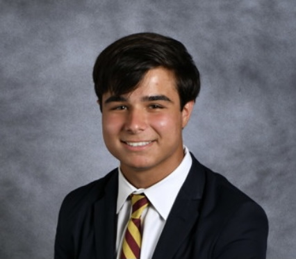
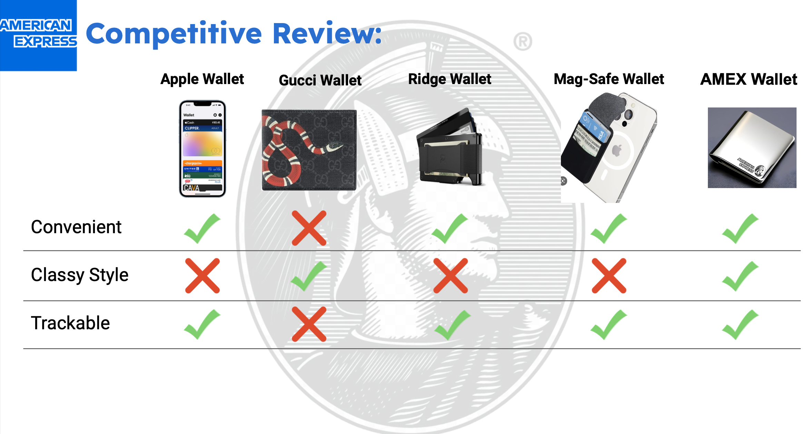

## About Me
Hello!

I am a Junior at Lehigh University. I am currently majoring in Finance with a minor in Real Estate. As a student, I have always excelled when working with numbers and mathematics. I possess strong communication and leadership skills and I am looking to work in Commercial Real Estate Brokerage following my graduation in May 2025.
<!-- Upload your own photo and change the path -->

  

---

## Portfolio

Below are a few projects I have worked on throughout my time at Lehigh.

<!-- You can link to other websites, PDFs in this repo, and other pages in this repo -->

_**[Real Estate Sale Price Prediction Model](model)**_

The above link shows python code for a model that predicts Real Estate Sale Prices for the given dataframe! As a Real Estate minor and someone who has interned in Real Estate brokerage, this was my personal favorite coding assignment to do.

---

_**[Eventual team project](https://wealth-advisor-dashboard-zxeuck5wssugu23mf7cjon.streamlit.app/)**_

Although not complete yet, the above link leads to my teams final project for our FIN 377 class. We are in the process of constucting a dashboard that acts as a wealth manager for its users. Users will take a short quiz and our dashboard will output an optimal portfolio of indices based on the user's preferences! 

---

_**[Marketing Brand Extension Project](/pdf/MKT_111.pdf)**_

This project was a group marketing final. We decided to do a brand extension for American Express by inventing the AMEX wallet. The concept is to combine your AMEX credit card and wallet into one, easy to use, metal, accessory. The prototypes we designed are shown below. In the link above, you can see all the aspects of our project such as the brand analysis, market research, advertising, financial analysis, and more!

---

## Career Objectives

My ultimate goal upon graduating Lehigh is to work as a Commercial Real Estate Broker in Investment Sales. I spent my summer after sophmore year working as a Real Estate Intern for Sackman and Keyah Enterprises. This helped me develope the necessary skills to work in leasing and property management. This upcoming summer, I will be working as a Commercial Real Estate Brokerage Intern for Invictus Property Advisors. In preparation for this role, I have begun working towards my New York State Real Estate Salesperson License.

I hope to continue to earn experience and develop the skills necessary to be successful in the New York Commercial Real Estate industry. 

---

## Hobbies

Outside of academic and career interests, here are a few of my hobbies:
- Community Service
  - Worked as the Community Service chair for Lehigh Psi Upsilon
- Skiing
- Avid NFL and NBA fan (Go Jets and Knicks!)
- Fitness
- Hiking
- Video Editing
- Going to the beach

---

Page template forked from <a href="https://github.com/evanca/quick-portfolio">evanca</a>

<!-- Remove above link if you don't want to attibute -->
